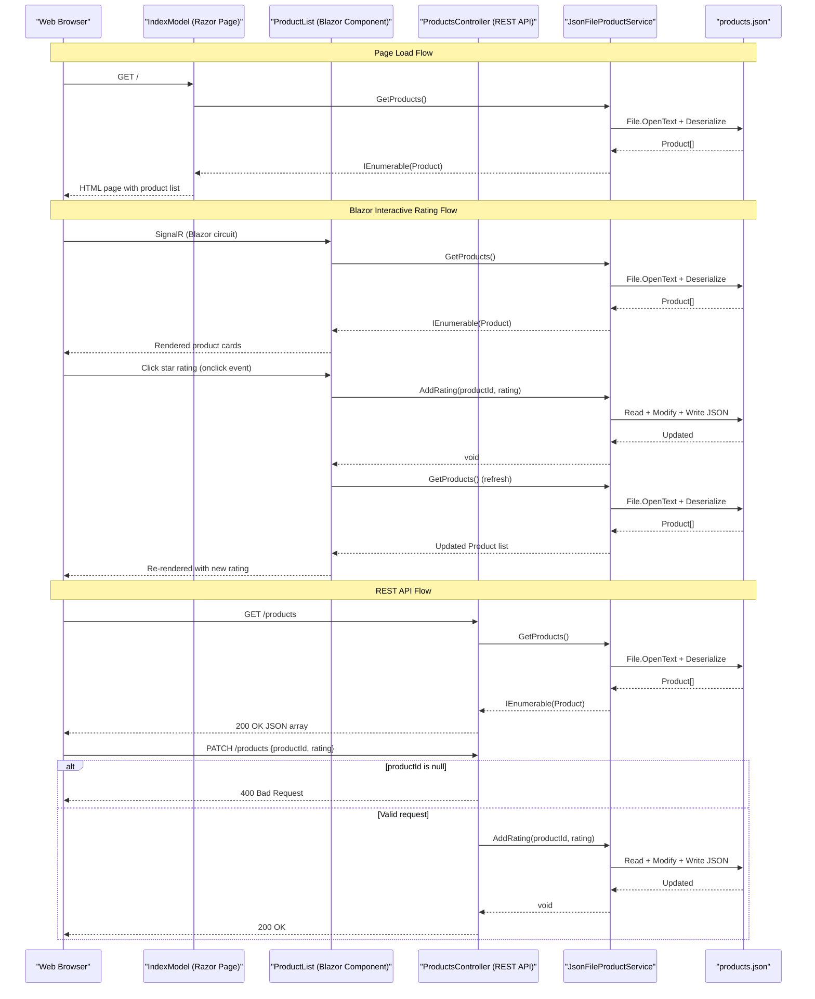

# API & Service Communication Contracts

ContosoCrafts.WebSite exposes a single REST API controller with 2 endpoints (GET and PATCH on `/products`) and serves its UI via Razor Pages and a Blazor Server component; all communication is synchronous and intra-process with no inter-service calls.

## Service Catalog

| Service | Port | Category | Purpose |
|---------|------|----------|---------|
| ContosoCrafts.WebSite | 5001 (HTTPS) / 5000 (HTTP) | Business | Monolithic ASP.NET Core 3.1 web application providing product catalog browsing and star rating functionality |

## API Endpoints Inventory

| Service | Method | Path | Request Type | Response Type |
|---------|--------|------|--------------|---------------|
| ProductsController | GET | /products | None | `IEnumerable<Product>` (JSON array) — 200 OK |
| ProductsController | PATCH | /products | `RatingRequest` (JSON body: `productId`, `rating`) | 200 OK on success; 400 Bad Request if `productId` is null |

## Management & Observability Endpoints

| Service | Endpoint | Custom Metrics |
|---------|----------|----------------|
| ContosoCrafts.WebSite | None configured | None |

No ASP.NET Core health checks (`/health`, `/healthz`), Swagger UI (`/swagger`), or any observability endpoints are configured. Logging is limited to `Console.WriteLine` calls in the Blazor component.

## DTOs & Contracts

Two data contracts are present in the application:

- **`Product`** (namespace `ContosoCrafts.WebSite.Models`): The primary domain entity used as both the data store record and the API response model. It is a mutable class (plain C# class, not a record) serialized using `System.Text.Json`. Field details are documented in `data-architecture.md`.
- **`RatingRequest`** (nested class inside `ProductsController`): A minimal request DTO used as the PATCH body. It contains `ProductId` (nullable string) and `Rating` (int). It is a mutable class with no immutability guarantee.

No OpenAPI/Swagger specification, `.proto` files, or GraphQL schema exist. Serialization is handled by `System.Text.Json` with `PropertyNameCaseInsensitive = true` for deserialization. The `img` JSON property is mapped to the `Image` C# property via `[JsonPropertyName("img")]`.

## Communication Patterns

**Synchronous only**: All communication is intra-process. The Razor Pages `IndexModel` and Blazor `ProductList` component both call `JsonFileProductService` directly via dependency injection (no HTTP hops). The REST API controller also calls the same service directly.

**No inter-service communication**: There are no `HttpClient`, `RestTemplate`, `WebClient`, or Feign client usages. There is no message broker, event bus, Kafka, RabbitMQ, or Azure Service Bus integration.

**No resilience patterns**: No circuit breaker (Polly, Resilience4j), retry policy, timeout configuration, or bulkhead pattern is configured.

**No service discovery or API gateway**: The application is a self-contained monolith with no service registry or gateway.

**Security posture**: No authentication or authorization is configured. `app.UseAuthorization()` is registered in the middleware pipeline but no authorization policies or authentication providers are set up. All endpoints — including the PATCH rating endpoint — are publicly accessible with no authentication checks. HTTPS redirection (`app.UseHttpsRedirection()`) is enabled, providing transport-level security, but there is no TLS certificate management configured beyond the default Kestrel development certificate.

## Service Technology Matrix

| Service | Web Framework | Data Access | Discovery | Gateway | Health Checks | Cache | Metrics |
|---------|---------------|-------------|-----------|---------|---------------|-------|---------|
| ContosoCrafts.WebSite | ASP.NET Core MVC + Razor Pages + Blazor Server | JSON file (System.Text.Json) | None | None | None | None | None |

## Service Communication Sequence

