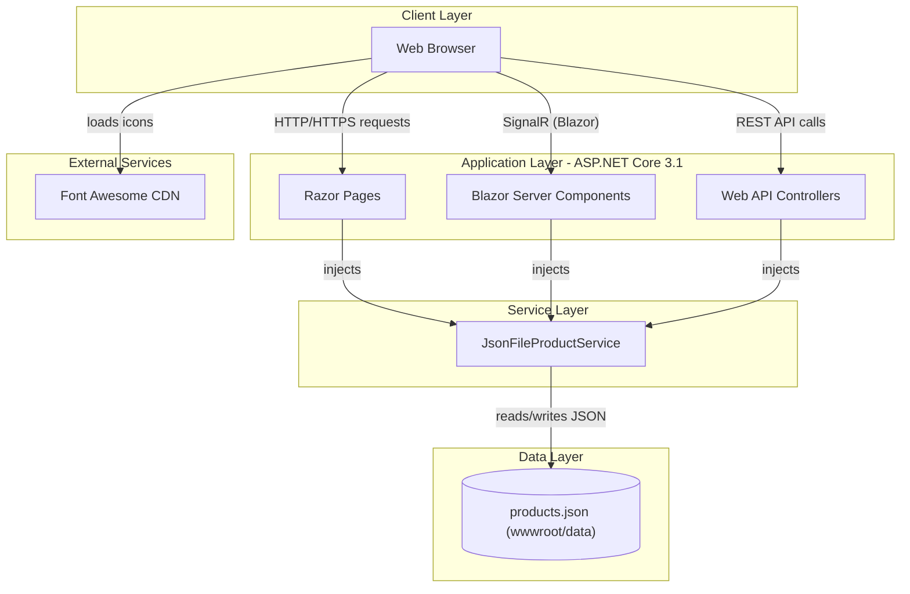
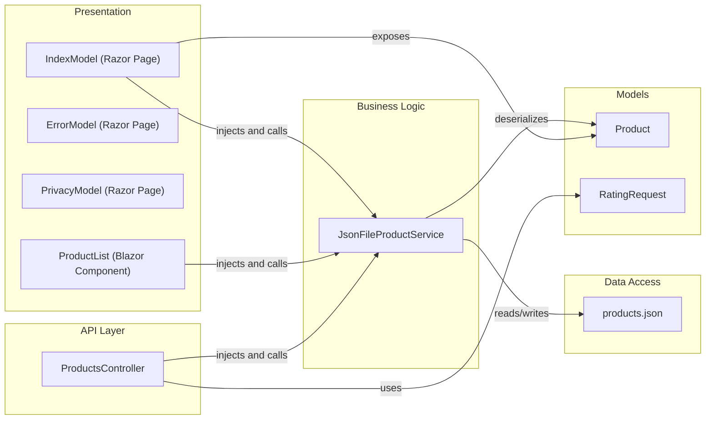

# Architecture Diagram

ContosoCrafts is an ASP.NET Core 3.1 web application that serves as a product catalog with rating capabilities, using a JSON file as a lightweight data store.

## Application Architecture

### Technology Stack Summary

| Layer | Technology | Version | Purpose |
|-------|-----------|---------|---------|
| Presentation | ASP.NET Core Razor Pages | 3.1 | Server-side HTML rendering for main pages |
| Presentation | Blazor Server | 3.1 | Interactive product listing component with real-time updates |
| API | ASP.NET Core Web API | 3.1 | REST endpoint for products and ratings |
| Service | JsonFileProductService | N/A | Business logic for product retrieval and rating |
| Data | JSON file (products.json) | N/A | Flat-file data store for product catalog |
| Runtime | .NET Core | 3.1 | Application runtime |

### Data Storage & External Services

The application uses a simple JSON file (`wwwroot/data/products.json`) as its data store, read and written directly by `JsonFileProductService`. There is no relational database, cache, or message broker. The only external service dependency is the Font Awesome CDN used for star rating icons in the Blazor component.

### Key Architectural Decisions

- Uses a flat JSON file as a lightweight data store instead of a relational database, keeping the application self-contained with no external database dependencies.
- Combines Razor Pages (for standard page rendering) and Blazor Server (for the interactive product list component) within the same ASP.NET Core application, with a REST API layer for PATCH operations (rating submission).
- Dependency injection is used throughout: `JsonFileProductService` is registered as `Transient` and injected into Razor Pages, Blazor components, and API controllers.

## Component Relationships

### Component Inventory

| Component | Layer | Type | Responsibility |
|-----------|-------|------|----------------|
| IndexModel | Presentation | Razor Page | Home page — loads and exposes the product list |
| ErrorModel | Presentation | Razor Page | Error handling page |
| PrivacyModel | Presentation | Razor Page | Privacy policy page |
| ProductList | Presentation | Blazor Server Component | Interactive product listing with modal detail view and star rating |
| ProductsController | API | MVC API Controller | REST endpoints: GET all products, PATCH to add a rating |
| JsonFileProductService | Business Logic | Service | Reads/writes product data from JSON file; adds ratings |
| Product | Models | Entity/DTO | Product data model (Id, Maker, Image, Url, Title, Description, Ratings) |
| RatingRequest | Models | DTO | Request payload for rating submission (ProductId, Rating) |
