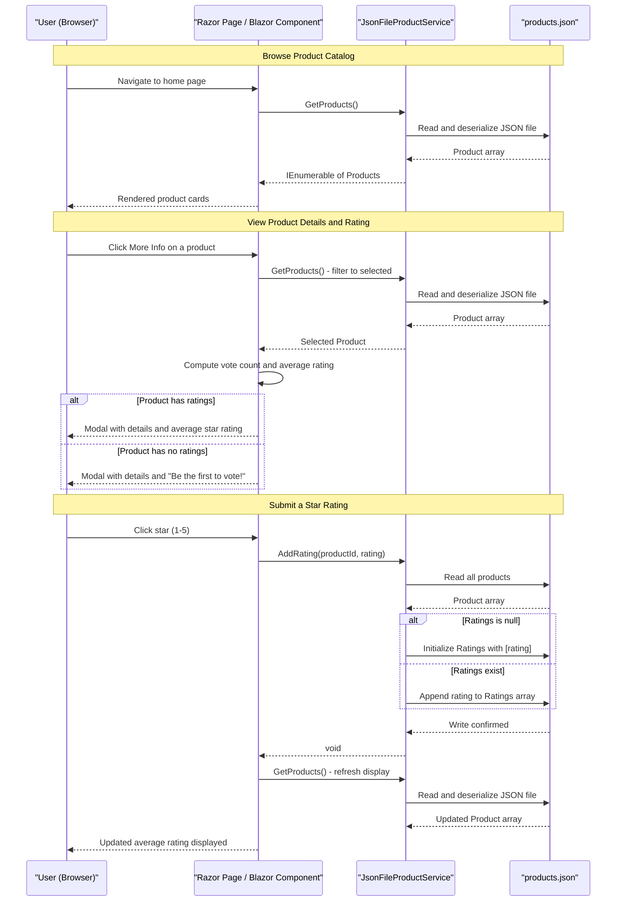

# Core Business Workflows

ContosoCrafts is a product catalog application that enables users to browse maker-crafted products and submit 1–5 star ratings for each item.

## Domain Entities

| Entity | Service / Bounded Context | Description | Key Relationships |
|--------|--------------------------|-------------|-------------------|
| Product | Product Catalog (single service) | Represents a maker-crafted item available for browsing and rating. Includes identity, display information, and accumulated user ratings. | Self-contained; no relationships to other entities |

## Service-to-Domain Mapping

| Service | Domain Context | Owned Entities | External Dependencies |
|---------|---------------|----------------|-----------------------|
| ContosoCrafts.WebSite | Product Catalog | Product | None |

The application is a single-service monolith. All domain logic is owned by `JsonFileProductService`. There are no cross-service boundaries, event buses, or external service dependencies.

## Primary Workflows

### Workflow 1: Browse Product Catalog

A user visits the home page and views all available products. The system reads the full product list from the JSON data store and renders each product as a card showing the product image and title. From the Razor Pages entry point, this is a single-step read operation.

**Steps:**
1. User navigates to `/` (home page)
2. `IndexModel.OnGet()` calls `JsonFileProductService.GetProducts()`
3. The service reads and deserializes `products.json`
4. All products are returned and rendered as HTML cards

### Workflow 2: View Product Details (Blazor Interactive)

A user clicks "More Info" on a product card in the Blazor component. The system displays a modal dialog with the product's full details (title, description, image) and the current average star rating alongside individual star controls.

**Steps:**
1. User clicks the "More Info" button on a product card (Blazor `onclick` event)
2. `ProductList.SelectProduct(productId)` is called
3. The service fetches all products and filters to the selected product
4. `GetCurrentRating()` computes the vote count and average rating from the `Ratings` array
5. The modal renders with product details and the computed average rating displayed as filled/unfilled stars

**Business Rule:** If the product has no ratings (`Ratings == null`), `currentRating` and `voteCount` default to 0 and the UI shows "Be the first to vote!".

### Workflow 3: Submit a Product Rating

A user clicks a star (1–5) in the product detail modal. The rating is recorded and the UI immediately reflects the updated average.

**Steps:**
1. User clicks a star control in the modal (Blazor `onclick` event fires `SubmitRating(currentStar)`)
2. `ProductList.SubmitRating(rating)` calls `JsonFileProductService.AddRating(productId, rating)`
3. `AddRating` reads all products from `products.json`
4. The target product's `Ratings` array is retrieved:
   - If `Ratings == null`: the array is initialized with `[rating]`
   - If `Ratings` is non-null: the new rating integer is appended to the existing array
5. The entire product list is serialized and written back to `products.json`
6. `SelectProduct(selectedProductId)` is called again to refresh the selected product's displayed state, re-computing and displaying the updated average rating

### Workflow 4: Retrieve Products via REST API

An API consumer fetches the product list as JSON via `GET /products` or submits a rating via `PATCH /products`.

**Steps (GET):**
1. Client sends `GET /products`
2. `ProductsController.Get()` calls `JsonFileProductService.GetProducts()`
3. Product list is returned as JSON (200 OK)

**Steps (PATCH):**
1. Client sends `PATCH /products` with `{ "productId": "<id>", "rating": <1-5> }`
2. `ProductsController.Patch()` validates that `request` and `request.ProductId` are non-null (returns 400 Bad Request if invalid)
3. `JsonFileProductService.AddRating(productId, rating)` is called (same logic as Workflow 3, Step 3–5)
4. Returns 200 OK

## Cross-Service Data Flows

ContosoCrafts is a monolith with a single data source (`products.json`). There are no cross-service data flows, gateway aggregation patterns, or inter-service communications. All read and write operations are handled by `JsonFileProductService` directly accessing the local JSON file. No circuit breaker or fallback patterns are needed or configured.

## Business Workflow Sequence

## Business Rules & Decision Logic

### Validation Rules

- **Rating null check (API):** `ProductsController.Patch()` returns HTTP 400 Bad Request if the incoming `RatingRequest` is null or `ProductId` is null. No range validation is enforced on the `Rating` integer at the API layer (any integer value is accepted).
- **No server-side rating range validation:** The star rating value (expected 1–5) is only enforced on the client side by limiting UI star controls to values 1–5. The API and service layer accept any integer.

### Decision Logic

- **Ratings initialization:** When `AddRating` is called and the product's `Ratings` array is `null`, it is initialized as a new single-element array `[rating]`. If it already exists, the rating is appended to the existing array.
- **Average rating computation:** Computed in the Blazor component as `Sum(Ratings) / Count(Ratings)`. Integer division is used, which may cause rounding down. If `Ratings` is null, `currentRating` and `voteCount` are both set to 0.
- **Vote label pluralization:** The UI displays "Vote" for exactly 1 vote and "Votes" for 2 or more.

### State Transitions

The `Product` entity has no formal lifecycle states. The only mutable field is `Ratings`, which transitions:
- `null` (no votes yet) → `int[] { rating }` (first vote) → `int[] { ..., rating }` (subsequent votes)

Ratings are append-only; there is no mechanism to edit, retract, or reset ratings.

### Business Constraints

- **No duplicate vote prevention:** Any user can submit any number of ratings for any product; there is no session tracking, authentication, or per-user vote limit.
- **No rating deletion or correction:** Once a rating is written to `products.json`, it cannot be removed or changed through any exposed API or UI.
- **Concurrency risk:** `AddRating` performs a non-atomic read-modify-write cycle on the JSON file without file locking. Concurrent rating submissions can cause data loss (last write wins, dropping intermediate ratings).

### Transactions & Error Handling

- No transaction management is in place. The `File.OpenWrite` call in `AddRating` does not use atomic replacement — a crash mid-write can corrupt `products.json`.
- No business exception types are defined. The only error handling is the null check in `ProductsController.Patch()`.
- No audit logging, change tracking, or event sourcing is implemented.

### Authorization

No authentication or authorization is implemented. All workflows (browse, view details, submit ratings) are accessible to any user without login, session management, or role checks.
