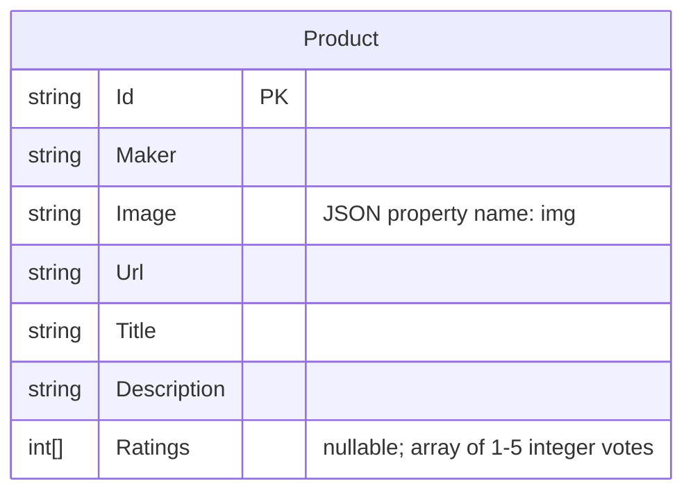

# Data Architecture & Persistence Layer

ContosoCrafts.WebSite has a single data entity (`Product`) persisted as a flat JSON file on the local filesystem; there is no relational database, ORM framework, or migration tooling.

## Database Configuration

| Service/Module | DB Type | Profile | Driver | Connection | Migration Tool |
|----------------|---------|---------|--------|------------|----------------|
| ContosoCrafts.WebSite | JSON file (flat file) | All environments | `System.Text.Json` (built-in) | `wwwroot/data/products.json` — path resolved via `IWebHostEnvironment.WebRootPath` | None — no schema versioning or migration tool configured |

Schema management is entirely manual: the JSON file is the authoritative data store and is committed directly to source control. There is no DDL, no migration history, and no seed script — the file itself serves as both the schema definition and the initial seed data (15 product records pre-populated).

## Data Ownership per Service

| Service | Tables / Files Owned | ORM Framework | Caching | Notes |
|---------|----------------------|---------------|---------|-------|
| ContosoCrafts.WebSite | `wwwroot/data/products.json` | None (direct `System.IO.File` + `System.Text.Json`) | None | Single flat file; entire file is read and rewritten on every write operation (no partial update) |

## Entity Model

The `Product` entity is defined in `src/Models/Product.cs`. There is only one entity — no relationships, foreign keys, or join tables exist.

## Key Repository Methods

| Service | Repository / Service | Notable Methods | Purpose |
|---------|----------------------|-----------------|---------|
| ContosoCrafts.WebSite | `JsonFileProductService` (`src/Services/JsonFileProductService.cs`) | `GetProducts()` | Reads and deserializes the entire `products.json` file; returns `IEnumerable<Product>` |
| ContosoCrafts.WebSite | `JsonFileProductService` | `AddRating(string productId, int rating)` | Reads all products, appends the new rating integer to the target product's `Ratings` array, then rewrites the entire JSON file |

There are no standard CRUD interfaces (no `IRepository`, no `DbContext`), no custom query methods with filters or projections, and no batch/bulk operations. There is no transaction management — concurrent write operations to `products.json` can cause data loss or corruption due to non-atomic read-modify-write cycles using `File.OpenWrite`.

## Caching Strategy

No caching layer is configured. Every call to `GetProducts()` performs a synchronous file system read and full JSON deserialization. There is no in-memory cache, distributed cache (Redis, MemoryCache, `IDistributedCache`), second-level cache, or query result cache.

This means the Blazor `ProductList` component calls `GetProducts()` on every render and re-selection, resulting in repeated file I/O with no performance optimization.

## Data Ownership Boundaries

The application is a single-service monolith with a single shared data file. There are no isolated data stores, no schema-per-service, no bounded contexts, and no inter-service data access patterns. The file `wwwroot/data/products.json` is the sole data store, directly owned and accessed by `JsonFileProductService`.

The read/write pattern is strictly synchronous and non-atomic: `GetProducts()` performs a full-file read on every invocation, and `AddRating()` performs a read-modify-write cycle without any file locking, making the implementation unsafe under concurrent requests.

### Data Classification & Sensitivity

| Entity | Fields | Classification | Controls in Place |
|--------|--------|----------------|-------------------|
| Product | Id, Maker, Image (URL), Url, Title, Description, Ratings | None (no PII, PHI, or PCI) | N/A |

No personally identifiable information (PII), protected health information (PHI), or payment card data (PCI) is stored. The `Maker` field contains GitHub usernames/handles (publicly available information, not sensitive PII). No encryption-at-rest, masking, or field-level access control is required or configured.
