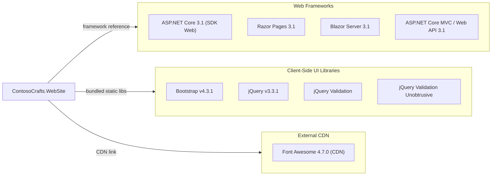

# Dependency Map

ContosoCrafts.WebSite is an ASP.NET Core 3.1 web application. It declares no explicit NuGet package references and relies entirely on the `Microsoft.NET.Sdk.Web` SDK implicit framework reference (ASP.NET Core 3.1), with client-side libraries (Bootstrap, jQuery) bundled in the wwwroot directory.

## Dependencies

### Dependency Summary

| Category | Count | Key Libraries | Notes |
|----------|-------|---------------|-------|
| Web Frameworks | 4 | ASP.NET Core 3.1, Razor Pages, Blazor Server, Web API | All provided via `Microsoft.NET.Sdk.Web` SDK reference; .NET Core 3.1 is end-of-life (EOL Dec 2022) |
| Client-Side UI | 4 | Bootstrap 4.3.1, jQuery 3.3.1, jQuery Validation, jQuery Validation Unobtrusive | Bundled in wwwroot/lib; no package manager (libman.json absent) |
| External CDN | 1 | Font Awesome 4.7.0 | Loaded via CDN in ProductList.razor; creates runtime external dependency |

### Version & Compatibility Risks

The most significant risk is that **ASP.NET Core 3.1 reached end-of-life in December 2022** and no longer receives security updates. The application should be upgraded to at least .NET 8 (LTS) or .NET 10 (current LTS). **Bootstrap 4.3.1** is an older minor version (Bootstrap 5.x is current) and contains known accessibility and utility gaps. **jQuery 3.3.1** is outdated (3.7.x is current); while not EOL, it misses several security and performance patches. **Font Awesome 4.7.0** is significantly outdated (6.x is current) and loaded unconditionally from a CDN, introducing a hard external runtime dependency.

### Notable Observations

- **No explicit NuGet package references**: All server-side functionality comes entirely from the `Microsoft.NET.Sdk.Web` implicit framework reference, making version control of individual packages opaque. Upgrading means updating the `<TargetFramework>` moniker.
- **No package manager for client-side assets**: Bootstrap, jQuery, and related libraries are committed directly to `wwwroot/lib` with no LibMan, npm, or other package manager manifest — this makes updating them error-prone and non-reproducible.
- **CDN dependency at runtime**: Font Awesome is referenced from `cdnjs.cloudflare.com` inside the Blazor component, creating a hard external dependency that will cause icon rendering failures in air-gapped or offline environments.
- **Minimal dependency footprint**: There are no ORM, messaging, caching, security library, or observability dependencies — all data access is via `System.Text.Json` reading a flat JSON file, which limits scalability.

## Test Dependencies

No test-scoped dependencies detected.

Total test-scope dependencies: 0
No test project or test framework dependencies were found in the solution. There is no test infrastructure (no xUnit, NUnit, MSTest, or other test framework configured). Adding a test project is recommended before modernization to establish a regression baseline.
