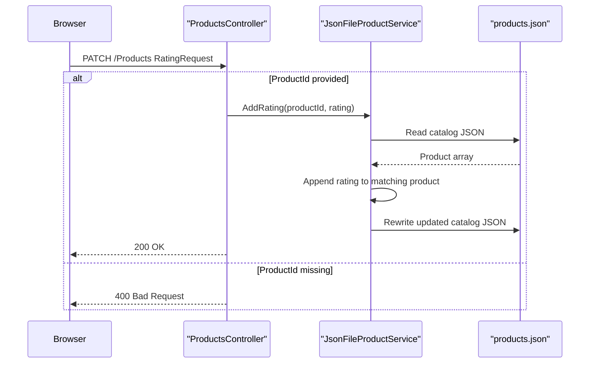

# API & Service Communication Contracts

The ContosoCrafts repository exposes a very small synchronous API surface: one controller with read and rating-update operations alongside the HTML experience. All requests are handled inside a single ASP.NET Core service with no downstream service-to-service communication.

## Service Catalog

| Service | Port | Category | Purpose |
|---|---|---|---|
| `ContosoCrafts.WebSite` | Not explicitly configured in repository | API Layer | Hosts the Razor Pages UI, server-side Blazor component, and `/Products` JSON API |

## API Endpoints Inventory

| Service | Method | Path | Request Type | Response Type |
|---|---|---|---|---|
| `ContosoCrafts.WebSite` | GET | `/Products` | None | `IEnumerable<Product>` with HTTP 200 |
| `ContosoCrafts.WebSite` | PATCH | `/Products` | JSON body `RatingRequest` | HTTP 200 on success, HTTP 400 when `ProductId` is missing |

## Management & Observability Endpoints

| Service | Endpoint | Custom Metrics (if any) |
|---|---|---|
| `ContosoCrafts.WebSite` | None detected | None detected |

## DTOs & Contracts

The API uses two contract types:

- `Product` is the response model returned by `GET /Products`. It represents a catalog item and is mutable because it is also rewritten back to disk after rating changes.
- `ProductsController.RatingRequest` is the request-body DTO for `PATCH /Products`. It carries the selected `ProductId` and numeric `Rating`.

No OpenAPI document, Swagger annotations, protobuf schemas, or GraphQL schemas were found. Serialization is handled with `System.Text.Json`, including a `JsonPropertyName` mapping for the product image field.

## Communication Patterns

All communication is synchronous and in-process:

- Browsers request Razor Pages and the `/Products` API over HTTP.
- The Blazor component and `ProductsController` both call `JsonFileProductService` directly.
- The service reads from and rewrites `wwwroot/data/products.json`; there are no asynchronous queues, background workers, or external service calls in the request path.

No circuit breaker, retry, bulkhead, timeout, service discovery, or API gateway configuration was found. `UseHttpsRedirection()` is enabled, but no authentication middleware, token validation, or authorization policies are configured, so the API surface is effectively public to any caller that can reach the application.

## Service Technology Matrix

| Service | Web | Data Access | Discovery | Gateway | Actuator | Cache | Metrics |
|---|---|---|---|---|---|---|---|
| `ContosoCrafts.WebSite` | Razor Pages, Controllers, Server-side Blazor | Custom JSON file service | No | No | No | No | No |

## Service Communication Sequence

