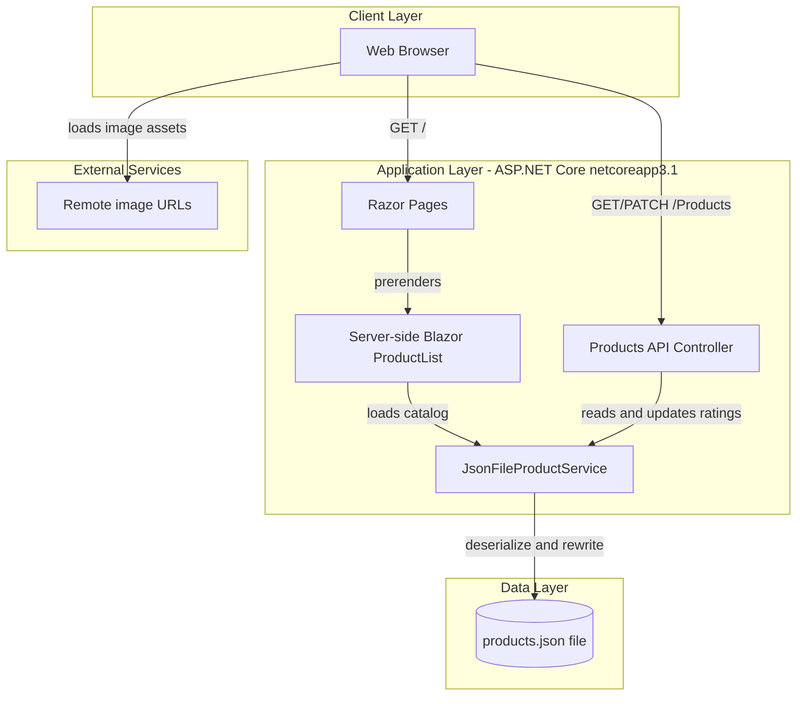
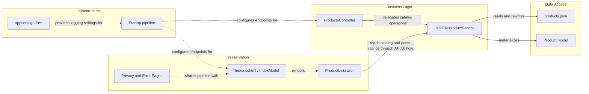

# Architecture Diagram

This document summarizes the ContosoCrafts application structure from both a runtime-layer and component-relationship perspective. The repository contains a single ASP.NET Core web application that combines Razor Pages, a server-side Blazor component, and a small JSON-backed API.

## Application Architecture

### Technology Stack Summary

| Layer | Technology | Version | Purpose |
|---|---|---|---|
| Presentation | ASP.NET Core Razor Pages | netcoreapp3.1 shared framework | Serves the main site shell and page routing |
| Interactive UI | Server-side Blazor | netcoreapp3.1 shared framework | Renders the product list and rating modal |
| API | ASP.NET Core Controllers | netcoreapp3.1 shared framework | Exposes `/Products` read and rating update endpoints |
| Application Service | `JsonFileProductService` | Repository code | Centralizes catalog reads and rating writes |
| Data Storage | `wwwroot/data/products.json` | File-backed | Stores the product catalog and accumulated ratings |

### Data Storage & External Services

The application does not use a relational database, cache, or message broker. All catalog data is read from and persisted back to a single JSON file under `wwwroot/data`, while product images are loaded from remote URLs embedded in the catalog data.

### Key Architectural Decisions

- Uses a single deployable web application rather than separate frontend and backend services.
- Reuses `JsonFileProductService` from both the Blazor UI and the API controller so all catalog mutations go through one abstraction.
- Keeps persistence extremely lightweight by storing state in a JSON document instead of an external database.

## Component Relationships

### Component Inventory

| Component | Layer | Type | Responsibility |
|---|---|---|---|
| `Startup` | Infrastructure | Startup configuration | Registers Razor Pages, Blazor, controllers, and the product service |
| `Index.cshtml` / `IndexModel` | Presentation | Razor Page | Entry page that hosts the server-side Blazor product list |
| `ProductList.razor` | Presentation | Blazor component | Displays products, opens modal details, and triggers rating submissions |
| `ProductsController` | Business Logic | API controller | Handles catalog reads and rating updates at `/Products` |
| `JsonFileProductService` | Business Logic | Application service | Loads products from JSON and persists updated ratings |
| `Product` | Data Access | Model | Represents catalog items exposed to both UI and API callers |
| `products.json` | Data Access | File store | Durable store for catalog metadata and rating arrays |
