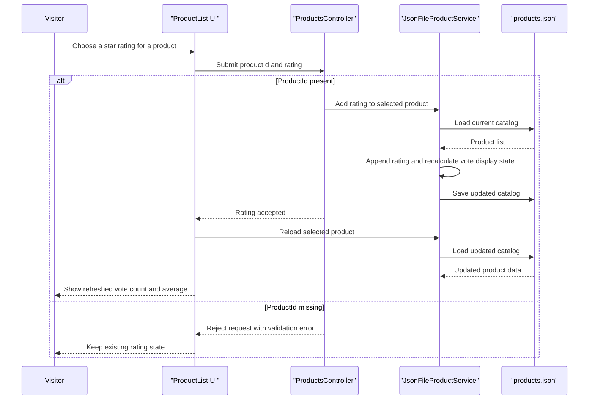

# Core Business Workflows

ContosoCrafts is a simple craft catalog application that lets visitors browse maker projects and submit community ratings. Its business behavior is concentrated in catalog display and rating capture rather than in multi-step transactional workflows.

## Domain Entities

| Entity | Service / Bounded Context | Description | Key Relationships |
|---|---|---|---|
| `Product` | `ContosoCrafts.WebSite` / Catalog | Represents a craft project shown in the site catalog with descriptive metadata and community ratings | Displayed by the Blazor product list and updated by the rating API |
| `RatingRequest` | `ContosoCrafts.WebSite` / Community Rating | Captures a visitor's rating input for a selected catalog item | Refers to a `Product` by `ProductId` when submitting a vote |

## Service-to-Domain Mapping

| Service | Domain Context | Owned Entities | External Dependencies |
|---|---|---|---|
| `ContosoCrafts.WebSite` | Catalog browsing and community rating | `Product`, `RatingRequest` | Remote product image URLs referenced by catalog records |

## Primary Workflows

### Workflow 1: Browse the craft catalog

1. A visitor opens the home page at `/`.
2. The Razor Page prerenders the `ProductList` Blazor component.
3. `ProductList` loads the product catalog through `JsonFileProductService`.
4. The visitor browses cards, opens the modal dialog, and reviews product details and current voting state.

Business rules involved:

- The catalog is read as a complete list rather than paged or filtered.
- When a product has no ratings, the UI displays "Be the first to vote!" instead of an average.

### Workflow 2: Submit a product rating

1. A visitor selects a star rating in the modal dialog.
2. The UI sends the chosen rating with the current `ProductId`.
3. `ProductsController.Patch` validates that `ProductId` is present.
4. `JsonFileProductService.AddRating` appends the rating to the product's existing vote array or creates the first rating entry.
5. The component reloads the product and recomputes the displayed average.

Business rules involved:

- Requests missing `ProductId` are rejected with HTTP 400.
- The UI only offers rating values from 1 through 5, although the server does not add an additional numeric range check.
- Average rating is displayed as an integer division of vote total by vote count.

## Cross-Service Data Flows

No cross-service aggregation is present. All business data is owned and served by the same ASP.NET Core application, and the only external references are static image URLs embedded in the catalog records. Because there are no downstream services, there is no fallback or circuit-breaker behavior affecting business results.

## Business Workflow Sequence

## Business Rules & Decision Logic

- Validation rule: `ProductsController.Patch` only checks for a non-null `ProductId`; if it is missing, the workflow stops with `BadRequest`.
- Vote initialization rule: the first rating creates a new ratings array, while later ratings append to the existing array.
- Computation rule: the displayed rating is the integer average of all stored votes, and the vote label changes between singular and plural based on count.
- Data integrity rule: catalog updates are file-level rewrites, so the full product list is reserialized after each accepted rating.
- Transaction and authorization posture: no explicit transaction boundary, audit trail, or role-based authorization rule is implemented for rating submissions.
