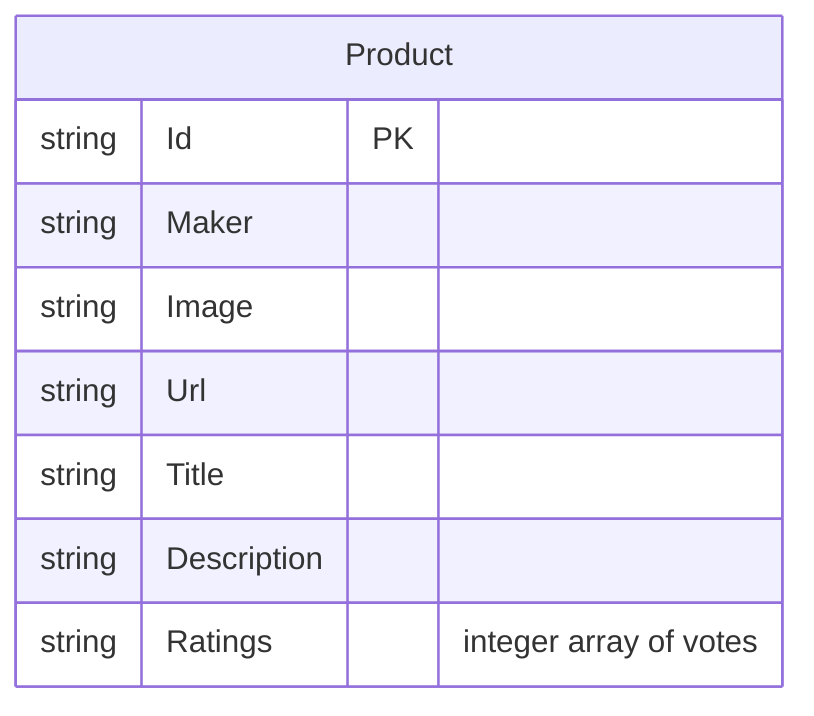

# Data Architecture & Persistence Layer

The data layer is intentionally simple: the application persists a single product catalog document to disk instead of using a relational database or external cache. One service class performs all reads and writes by serializing `Product` objects with `System.Text.Json`.

## Database Configuration

| Service/Module | DB Type | Profile | Driver | Connection | Migration Tool |
|---|---|---|---|---|---|
| `ContosoCrafts.WebSite` | JSON file store | Default, Development | Not applicable | `src/wwwroot/data/products.json` on local file system | None |

## Data Ownership per Service

| Service | Tables Owned | ORM Framework | Caching | Notes |
|---|---|---|---|---|
| `ContosoCrafts.WebSite` | Product catalog document | None; custom `System.Text.Json` serialization | None | Single application owns the full catalog file and rewrites it in place |

## Entity Model

## Key Repository Methods

| Service | Repository | Notable Methods | Purpose |
|---|---|---|---|
| `ContosoCrafts.WebSite` | `JsonFileProductService` (`src/Services/JsonFileProductService.cs`) | `GetProducts()` | Opens the JSON file and deserializes the full product catalog |
| `ContosoCrafts.WebSite` | `JsonFileProductService` (`src/Services/JsonFileProductService.cs`) | `AddRating(string productId, int rating)` | Finds a product, appends a rating, and rewrites the JSON file with updated contents |

## Caching Strategy

| Layer | Provider | TTL | Pattern | Rationale |
|---|---|---|---|---|
| Application reads | None | None | Direct file read on demand | The catalog is small enough to be loaded from disk for each interaction without an additional cache layer |

## Data Ownership Boundaries

The repository contains a single deployable application and a single owned data store, so there are no cross-service ownership boundaries to manage. All reads and writes occur through `JsonFileProductService`, and no other process, repository, or module is configured to query or mutate the catalog through a shared database, API, or batch interface.

### Data Classification & Sensitivity

| Entity | Sensitive Fields | Classification (PII/PHI/PCI/None) | Controls in Place |
|---|---|---|---|
| `Product` | None identified in the persisted model | None | Public catalog metadata and anonymous rating numbers only; no special masking or encryption controls declared |
