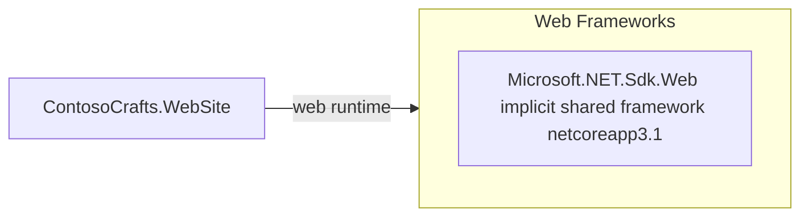

# Dependency Map

This project has a very small declared dependency surface. The build file declares the ASP.NET Core web SDK and relies on the shared framework rather than explicit third-party package references, resulting in one primary direct dependency group and no test-only packages.

## Dependencies

### Dependency Summary

| Category | Count | Key Libraries | Notes |
|---|---|---|---|
| Web Frameworks | 1 | Microsoft.NET.Sdk.Web shared framework | Supplies ASP.NET Core hosting, Razor Pages, controllers, and Blazor server capabilities through the web SDK |
| Database / ORM | 0 | None declared | Persistence is file-based JSON, not an ORM-backed database stack |
| Messaging | 0 | None declared | No queue or eventing libraries are declared |
| Caching | 0 | None declared | No cache package references are present |
| Logging | 0 | Shared framework only | Logging comes from the built-in ASP.NET Core stack, not explicit packages |
| Security | 0 | Shared framework only | No separate authentication or identity package references are declared |
| Observability | 0 | None declared | No health-check, metrics, or telemetry packages are declared |
| Utilities | 0 | None declared | No extra utility libraries are explicitly referenced |

### Version & Compatibility Risks

The key compatibility risk is the target framework itself: `netcoreapp3.1` is out of support, and the baseline build already emits `NETSDK1138`. Because the project depends on the implicit ASP.NET Core shared framework, upgrading the target framework is the main dependency modernization task rather than reconciling a large package graph.

### Notable Observations

- The `.csproj` contains no `<PackageReference>` items, so nearly all functionality comes from the SDK-provided shared framework.
- The absence of explicit dependencies keeps the upgrade surface small, but it also means framework upgrades can affect multiple capabilities at once.
- No separate data-access or caching library is declared because persistence is implemented directly against a JSON file.

## Test Dependencies

| Framework | Version | Notes |
|---|---|---|
| None detected | N/A | The repository does not contain a test project or test-scoped package references |

Total test-scope dependencies: 0

No test dependencies were detected from the build files, which matches the lack of a dedicated test project in the solution.
